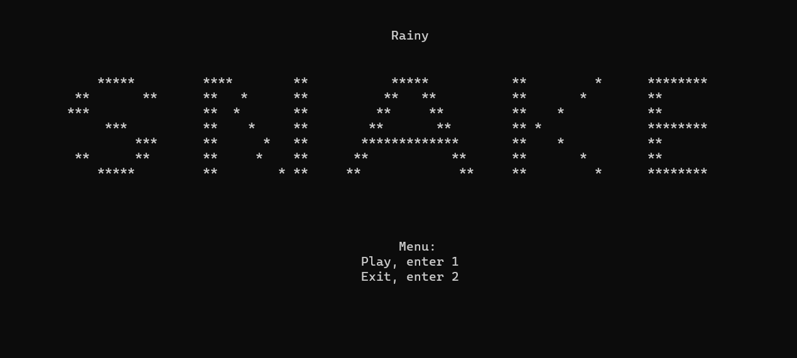
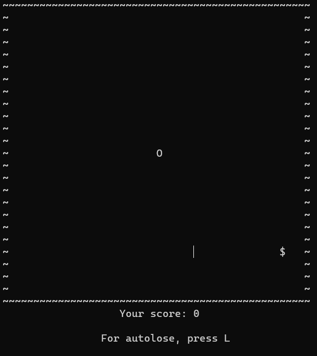
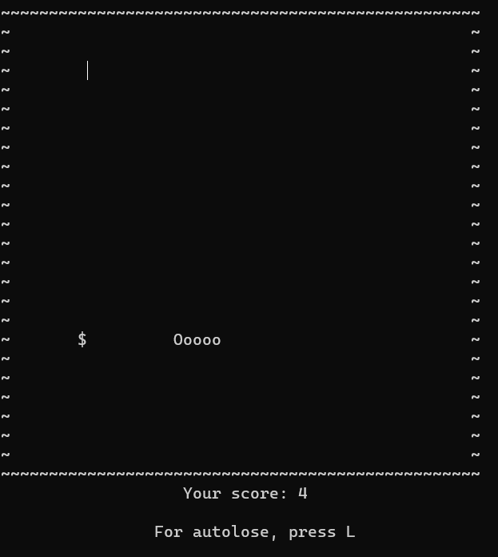
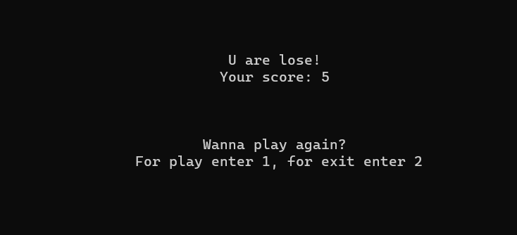

# Rainy Snake

It's a terminal game about a snake in the rain. 
You may compile this in VS 2017 than you can play in game!

### *Game Process*
When you launch it, you are greeted with a menu.
*Example menu*:

- If you enter 1, game will start and show the playing field.
- If you enter 2, game will close.  

*Example playing field*:

Snake stands all time while you don't press 'w', 'a', 's', 'd'. If you press anyone button from list of button, game starts. You can autolose when u press 'L' button. You will lose if snake crashes in the walls  or in her tail. Snake and youtr score will grow if you collect '$'.

*Example started game*:

If you lose, you will see your final score and an offer to play again. You can agree than game will start again or disagree than game will close.

*Example offer to play again*:

- If you enter 1, game will start again.
- If you enter 2, game will close.  